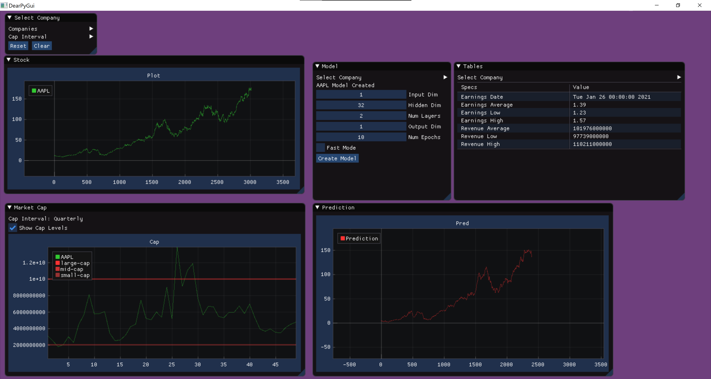
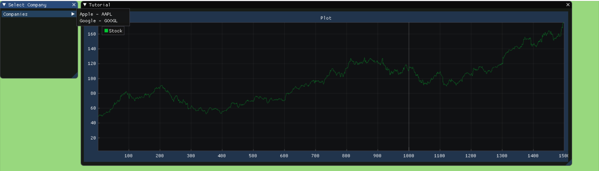

# StockV

StockV is a desktop app created with the goal of consolidating and visualizing data related to the stock and the stock market. The GUI was built using dearpygui.

## Features

### Dashboard

The main dashboard contains multiple dynamic panels, each containing unique information. In the "Select Company" panel, you can select a company, and then view their recent stock prices, market cap, and earnings summary.

### Live Data

All the data displayed in the dashboard is live and comes from the yfinance API.

### Stock PRediction

As a side feature, StockV uses PyTorch to create an LSTM model and make basic predictions about the price of stocks based on their current trend. You are able to play around with the parameters of the model in realtime in the GUI by using the Model panel.

Obviously the predictions should not be taken serious, but it is fun to play around with them and see how they matched up against real world results.
